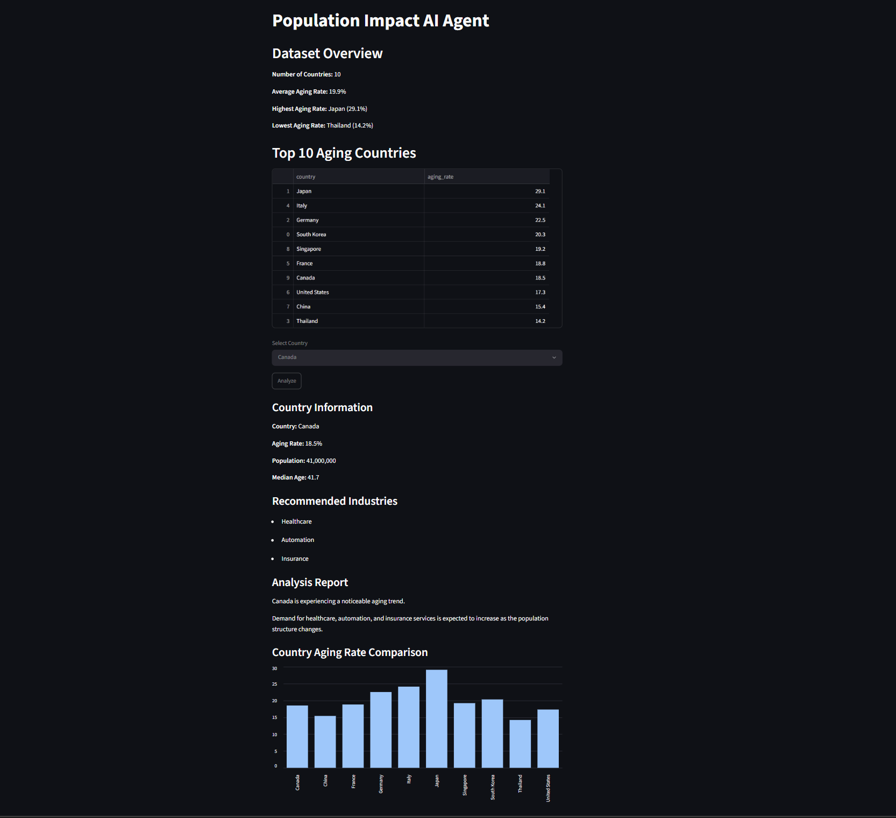

# Population Impact AI Agent

A web-based demographic analysis application that evaluates population aging trends and generates industry recommendations based on demographic indicators.

## Application Preview



---

## Project Motivation

Population aging is one of the most significant demographic challenges facing modern societies.

I became interested in how demographic changes influence economic structures and industrial development. To explore this topic through software engineering and data analysis, I developed Population Impact AI Agent.

The project combines demographic research, data analysis, visualization, and web application development into a single system.

---

## Key Features

### Demographic Analysis

The application analyzes:

* Aging Rate
* Population Size
* Median Age

### Industry Recommendation System

Based on demographic characteristics, the system recommends industries that may benefit from future population trends.

Examples include:

* Healthcare
* Silver Industry
* Medical Devices
* Automation
* Insurance
* Education
* Technology

### Interactive Dashboard

Built with Streamlit:

* Country selection dropdown
* Demographic analysis dashboard
* Industry recommendations
* Analysis reports
* Dataset overview
* Top aging-country rankings

### Data Visualization

* Country aging-rate comparison chart
* Top aging-country ranking table
* Dataset summary statistics

---

## Technology Stack

* Python
* Pandas
* Streamlit
* Git
* GitHub

---

## Project Structure

```text
population-impact-ai-agent

├── data
│   └── countries.csv
├── images
│   └── app_screenshot.png
├── app.py
├── main.py
├── README.md
└── .gitignore
```

---

## Learning Outcomes

Through this project, I learned:

* Data analysis using Pandas
* Data visualization techniques
* Web application development with Streamlit
* Version control using Git and GitHub
* Translating demographic research into software solutions

---

## Future Improvements

Potential future developments include:

* Larger demographic datasets
* Advanced demographic forecasting
* Machine learning models
* AI-generated reports
* Real-time demographic data integration

---

## Author

Independent software and data analysis project focused on demographic intelligence and industry forecasting.

